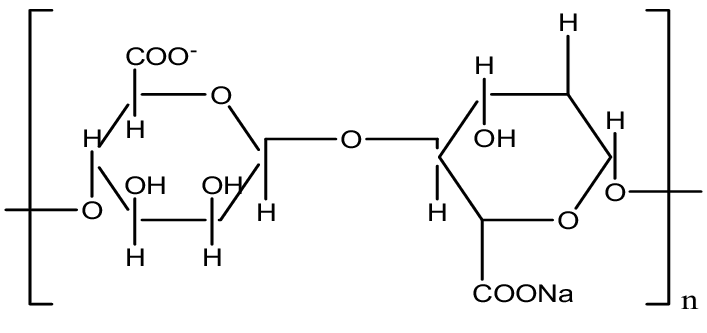
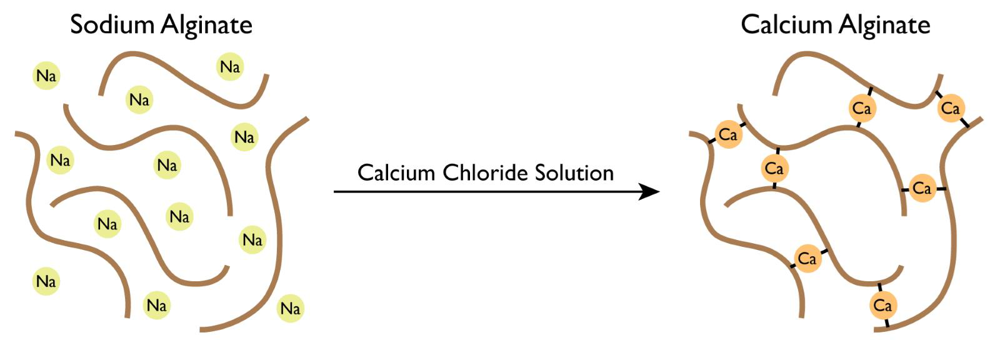

## **What Function Does Spherification Have in Cooking?**

Spherification is a **culinary technique** that transforms liquids—such as juices, sauces, or broths—into small spheres with a thin gel membrane. When bitten, these spheres **explode**, releasing a burst of flavor. This technique, pioneered by Ferran Adrià at El Bulli, has become a hallmark of **modernist molecular cuisine**, allowing chefs to create new textures and presentations leveraging concepts in chemistry and more generally science.

The process relies on a **chemical reaction** between **sodium alginate** (a gelling agent derived from seaweed) and **calcium ions**. When a liquid containing sodium alginate comes into contact with calcium, a gel forms around it, trapping the liquid inside. The result? A visually striking and flavorful experience that elevates both **taste and texture**. This is known as a **polymerization** reaction

## **The Science Behind the Ingredients**

The success of spherification depends on two key ingredients:

### **Sodium Alginate: The Gelling Agent**

* **What it is:** A natural polysaccharide extracted from brown seaweed (genus *Laminaria*).
* **How it works:** When dissolved in water or juice, sodium alginate **remains in a free-flowing liquid state**. However, in the presence of calcium ions, it **cross-links into a gel**, forming a delicate membrane around droplets of liquid.

* **Why it’s special:** Unlike gelatin (which requires heat to set), sodium alginate forms a gel at room temperature when exposed to calcium. This allows for the creation of **cold, fresh, and vibrant spheres** without altering the flavor of the liquid inside.

### **Calcium: The Binding Agent**

* **Why calcium is needed:** Sodium alginate on its own won’t form a gel—it requires the presence of **calcium ions** to create a stable structure.
* **Common calcium sources used in spherification:**

  * **Calcium chloride (CaCl₂):** Used in direct spherification. Provides a fast and strong reaction but has a slightly bitter taste, requiring spheres to be rinsed before consumption.
  * **Calcium lactate (Ca(C₃H₅O₃)₂):** Used in reverse spherification. Milder in flavor and ideal for liquids that already contain some calcium.
* **How calcium works in the process:** When sodium alginate meets calcium, the calcium ions act as **"molecular bridges"**, linking the alginate molecules together and forming a **gel-like network** around each drop of liquid.

## **What Happens When the Proportion of Alginate or Calcium Is Incorrect?**

Precision is **crucial** in spherification. If the proportions of alginate and calcium are not balanced, the spheres may not form correctly:

* **Too little alginate?** The droplets won’t hold their shape, leading to weak or broken spheres.
* **Too much calcium?** The gel can become **too thick**, making the spheres rubbery instead of delicate.
* **If the liquid contains natural calcium (e.g., milk or certain juices)?** The reaction can **start too early**, causing clumps instead of smooth spheres.

Just like in baking, **exact measurements and controlled conditions** are necessary to achieve the perfect texture.

## **What Happens When the Proportion of Alginate or Calcium Is Incorrect?**

Precision is **crucial** in spherification. If the proportions of alginate and calcium are not balanced, the spheres may not form correctly:

* **Too little alginate?** The droplets won’t hold their shape, leading to weak or broken spheres.
* **Too much calcium?** The gel can become **too thick**, making the spheres rubbery instead of delicate.
* **If the liquid contains natural calcium (e.g., milk or certain juices)?** The reaction can **start too early**, causing clumps instead of smooth spheres.

Just like in baking, **exact measurements and controlled conditions** are necessary to achieve the perfect texture.

## **Which Liquids Are Best for Spherification?**

For the best results, the liquid used in spherification should have the **right pH level** (above 3.6) and **low calcium content**.

**Recommended Liquids:**

* **Fruit Juices:** Apple, orange, strawberry (moderate acidity, good viscosity).
* **Vegetable Juices:** Carrot, beetroot (bright colors, slightly thicker texture).
* **Broths and Infusions:** Savory options like tomato broth, herb-infused water.

**Liquids to Avoid (Without Adjustments):**

* **Highly Acidic Juices:** Lemon, lime, and grapefruit can prevent the gel from forming. **Solution:** Add **sodium citrate** to neutralize the acidity.
* **Liquids with High Calcium Content:** Dairy-based liquids (milk, yogurt) or calcium-fortified juices will begin to gel before they are dropped into the bath. **Solution:** Use **reverse spherification** instead.

## **Did You Know?**

Highly acidic liquids interfere with the **ionic bonding** needed for the gel to form. If working with citrus juices or other acidic solutions, adding a small amount of **sodium citrate** can help balance the pH and improve the spherification process.

## **Make It at Home!**

**Objective:**\
Help participants understand how a **simple chemical reaction** can be used to transform a liquid into edible spheres, demonstrating the principles of **molecular gastronomy**.

**Methodology:**\
The activity is divided into two parts:

1. **Preparing the Base:** Already done if using a pre-mixed alginate liquid.
2. **Forming and Observing the Gelation:** Dropping the liquid into a calcium bath to watch the reaction happen.

**Public:** Suitable for all ages.

### **Materials Needed**

* **Alginate-Infused Liquid:** Juice, broth, or any liquid mixed with sodium alginate.
* **Calcium Bath:** Dissolve **calcium chloride (1–2 g per 100 mL water)** in a large bowl.
* **Pipettes or Spoons:** To carefully form the droplets.
* **Bowls of Water:** For rinsing the spheres after formation.

## **Step-by-Step Activity**

### **1. Assemble the Base**

* If making from scratch, **blend sodium alginate** into the chosen liquid (**0.5–1% by weight**).
* Let it **rest** for at least 30 minutes to remove air bubbles.

### **2. Form the Spheres**

* Use a **pipette or spoon** to drop small amounts of the alginate solution into the calcium bath.
* Watch as each drop **immediately forms a thin gel shell** and retains its spherical shape.

### **3. Rinse and Observe**

* Remove the spheres with a slotted spoon or sieve.
* Transfer them to a bowl of **plain water** to remove excess calcium chloride and prevent over-gelation.

### **4. Taste the Results!**

* The spheres are now ready to eat!
* Discuss how adjusting the ingredients (alginate, calcium, acidity) **impacts the final texture**.

## **In Summary**

Spherification is the **perfect blend of science and culinary creativity**. By understanding how **sodium alginate and calcium interact**, chefs and food enthusiasts can create unique, edible spheres that enhance both **presentation and flavor**. Whether making fruit caviar for desserts or olive oil pearls for a gourmet dish, this technique **adds excitement to any plate**.

Experiment with different liquids, adjust the conditions, and discover the **endless possibilities** of molecular gastronomy.
