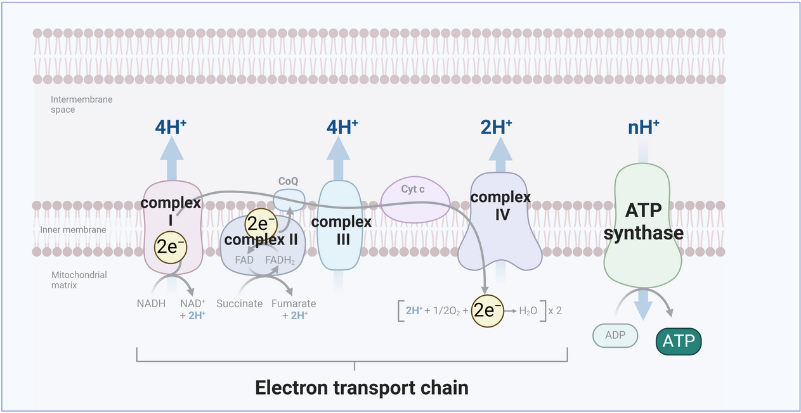
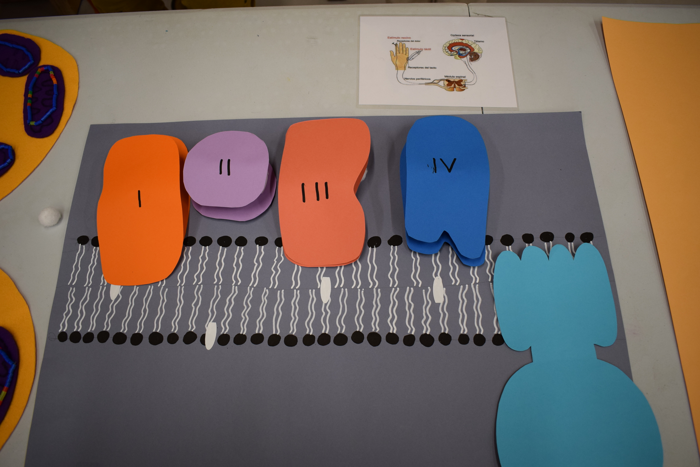

## Qué función tienen las mitocondrias en nuestro cuerpo?

Las mitocondrias se encuentran en el interior de la mayoría de las células eucariotas y tienen su **propia información genética (ADN).** Entre otras funciones, son los responsables de producir una forma de energía llamada **ATP**, para que la célula pueda realizar sus funciones. Esta energía se realiza a través de un proceso llamado **respiración celular**, donde las mitocondrias convierten la energía de los nutrientes ingeridos en una forma de **energía útil** para las células, el ATP.

La cantidad de mitocondrias en el interior de cada célula varía en función de sus necesidades energéticas, siendo los músculos, el cerebro y el corazón los órganos que tendrán grandes cantidades, ¡incluso pueden haber miles!

Dentro de la cadena respiratoria, los electrones (con carga negativa) se van moviendo a través de una serie de “**complejos**” situados en la membrana interna de la mitocondria, generando un gradiente de protones (con carga positiva), que utilizará la **ATP sintasa** para generar ATP.

## Qué pasa cuando el ADN mitocondrial tiene una mutación?

Las mutaciones en la información genética (ADN) que existen en el interior de la mitocondria pueden tener su origen en diversas causas: estrés en la célula, la herencia mitocondrial, mutaciones en el ADN del núcleo, el envejecimiento, etc,. Estas mutaciones **dañan**, por ejemplo, los “**complejos**” que participan en la respiración celular, haciendo que los electrones no puedan llegar a su destino, o que se trasladen hacia otras vías, como por ejemplo, a la generación de **especies reactivas de oxígeno (ROS)**, que pueden llegar a causar mucho daño a las mitocondrias.

Así pues, las mutaciones en el ADN mitocondrial hacen disminuir la capacidad de producir energía en las mitocondrias. Los primeros órganos afectados son aquellos que mayor demanda energética tienen, generando problemas de salud como la debilidad muscular, el fallo cardíaco o la pérdida de conexiones neuronales, etc. Esta situación recibe el nombre de enfermedades mitocondriales y hoy en día se consideran enfermedades minoritarias.

## ¿Cuáles son y qué partes del cuerpo afectan a las mutaciones en el ADN mitocondrial?

* **Síndrome de Alpers-Huttenlocher**: cerebro (epilepsia, dolor de cabeza, pérdida de función cognitiva, etc,.), hígado (insuficiencia hepática) y vista (pérdida de agudeza visual y movilidad ocular)
* **Síndrome de Leigh**: cerebro (trastornos de movimiento, falta de equilibrio) y músculos (pérdida de tono muscular).
* **Síndrome de Pearson**: cerebro (retraso del habla), trato gastrointestinal (vómitos, diarrea), páncreas (insuficiencia pancreática).
* **Síndrome de Kearns-Sayre**: vista (afecta a la retina y puede provocar ceguera), oído (pérdida auditiva) y corazón (miocardiopatía, trastorno de conducción)

### ¿Lo sabías?

El tacto, aparte de los demás sentidos, también puede estar dañado debido a las mutaciones en el ADN mitocondrial. ¡Las conexiones nerviosas necesarias para sentir que estamos tocando un objeto podrían estar alteradas, haciendo que no lo pudiéramos sentir!

## ¡Hazlo en casa!

**Objetivo**. Ayudar a los participantes a entender cómo las mutaciones mitocondriales afectan a la función celular mediante el uso de modelos prácticos para simular el ADN mitocondrial (ADNmt) y la producción de energía.

**Metodología**. La actividad se divide en dos estaciones: la primera para ensamblar el ADNmt, y la segunda para construir la cadena de transporte de electrones mientras se explican las consecuencias de las mutaciones del ADNmt.

**Público**: todo el público

**Materiales**:

* Hebra de ADNmt: Utiliza perlas e hilo para hacer una hebra circular de ADNmt. Asegúrate de conseguir piezas de diferentes colores para representar las mutaciones.
* Cartulina, idealmente de diferentes colores, para reconstruir todos los componentes de la cadena de transporte de electrones.
* Bolas de fieltro
* Rotulador permanente

**Descripción de la actividad**:

1. Ensamblar el ADN

Utiliza las perlas y el hilo para hacer una hebra de ADNmt. Construye dos modelos, el modelo sano (en el que todas las piezas son del mismo color) y el modelo mutado (algunas perlas se sustituyen por piezas de otro color, que simbolizan las mutaciones).

2. Visualización de los efectos energéticos de la enfermedad mitocondrial

El ADNmt codifica trece proteínas implicadas en la producción de energía celular y en los procesos de fosforilación oxidativa. Por eso, la cadena de transporte de electrones (CTE) en mitocondrias con mutaciones del ADNmt se ve afectada.

Para simularlo, primero recorta en cartulinas de diferentes colores los componentes de la CTE:

* cuatro complejos proteicos (I, II, III, IV)
* ATP sintasa
* Trozos pequeños que representan protones (H+)
* Moléculas de ATP

En un trozo grande de cartulina, dibuja la membrana mitocondrial interna, recordando que está formada por una bicapa de fosfolípidos.

Pon las piezas recortadas enzima de la membrana mitocondrial interna que acabas de dibujar. Sigue el siguiente esquema (foto adjuntada).

3. Simula el funcionamiento de la CTE:

   1. Coloca los protones en la matriz mitocondrial, que es la parte que queda debajo de la membrana.

   2. Coge el electrón, representado por la bola de fieltro, y pásalo por los cuatro complejos proteicos (recuerda que el electrón puede entrar por el primer o el segundo complejo de la CTE, dependiendo del donante de electrones).

   3. A medida que el electrón se desplaza a través de un complejo, los protones (H+) son transportados desde la matriz mitocondrial hasta el espacio intermembrana, atravesando la membrana.

   4. Finalmente, desplaza los protones acumulados en el espacio intermembrana hacia la ATP sintasa, que es donde se producirá la energía en forma de ATP.

Ahora bien, en el modelo de ADN mutante, si una proteína que compone el complejo proteico no es funcional, el electrón no puede atravesar todos los complejos de manera eficiente, lo que reduce el movimiento de protones y, en consecuencia, la producción de ATP.
